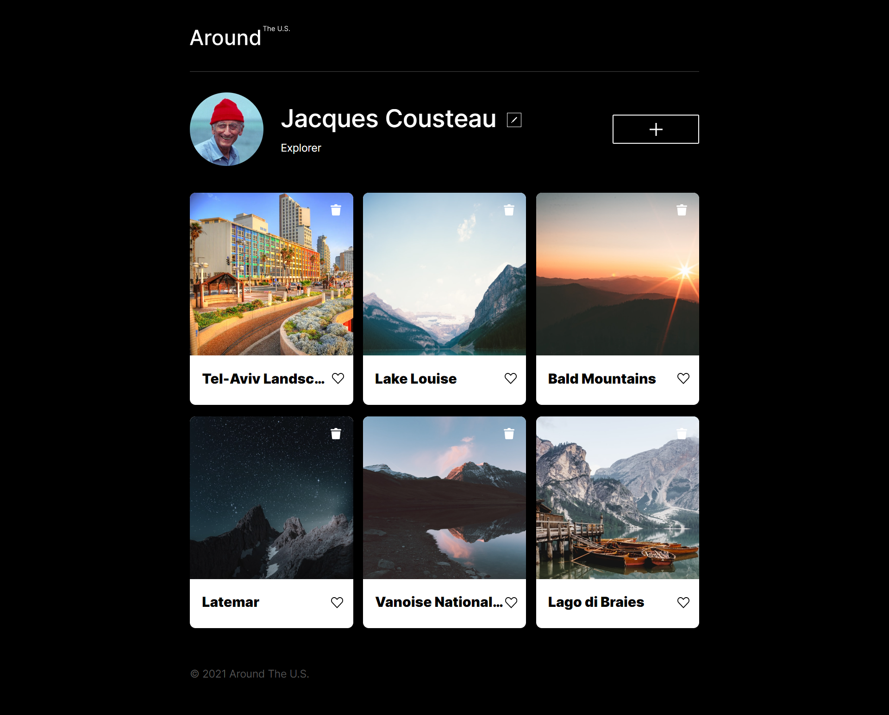

# Project 4: Around the U.S.

### Overview

- this site is made as the second part of a series, for educational perpose. its aim is to get to know better how to code in Javascript and how to use it in a real website.
- a full use of branches has also been preformed during the development of the site.

**Technologies in site:**

- This page is cross platform compatible, and can fit down to 320px Smartphone’s resolution.
- JS code is used, making the page interactive and adjustable by the user.
- Tamplate structure is used, in order to "irragate" content content to it from an outer source. in this phase, an array is written on the JS file is used in order to simulate this funcionality.
- an "Add image" form is created, letting the user to add content to the site.

**Screenshots of the site:**

A screenshot of the site:

**farther development Ideas**

- Possibility to add images by special popup menu.
- Page persistence, in order to permit the user adapts the page to his own needs, and keep changes in device.

Made Prowdly using JavaScript!

**site on gitHub Pages**
https://asafe123.github.io/web_project_4/
